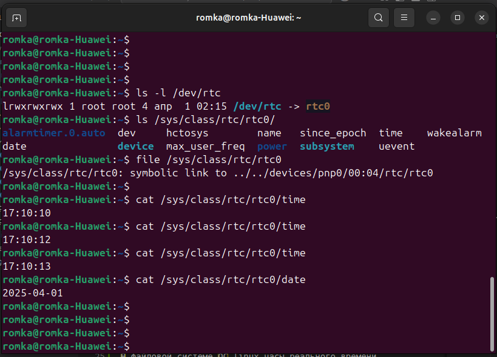
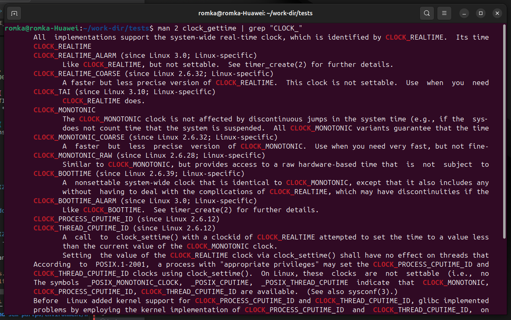
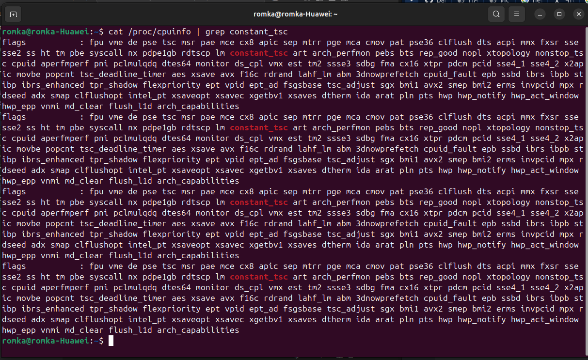
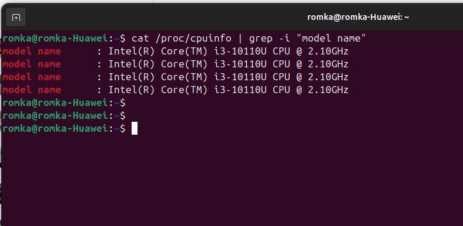

= История №2: Компьютерное время
Выполнил работу: Касимов Роман Эльмирович, ст. гр. Б22-515

== Описание лабораторного стенда

=== Описание используемой рабочей среды
* Процессор: Intel(R) Core(TM) i3-10110U CPU, 2.10GHz, 2 ядра, 4 логических процессора
* Установленная оперативная память (RAM): 8Gi.
* Тип памяти: DRAM 
* Операционная система: Ubuntu 24.04 LTS
* Компилятор: g++(gcc) 13.3.0
* Язык программирования: c

== Теоретические вопросы
=== Структуры данных для хранения меток времени
* Язык C:
.. struct timespec (наносекундная точность)
.. struct timeval (микросекундная точность)
.. struct __timespec64 (аналог timespec с поддержкой времени после 2038 года)
.. time_t
.. tm (в основном для календарных операций)
* Язык C++
.. std::chrono 
. Часы реального времени в Linux
В файловой системе ОС linux часы реального времени представленны симлинком _/dev/rtc_ на _rtc0_

Для работы с часами можно использовать файлы _date_, _time_, _since_epoch_, позволяющие узнать текущие дату, время и количество секунд UNIX времени соответсвенно
Также доступна утилита командной строки _hwclock_

image::../images/hwclock.png[Клоки]

=== Типы часов, предоставляемых операционной системой
* С
.. CLOCK_REALTIME
.. CLOCK_MONOTIC
.. CLOCK_BOOTTIME
.. CLOCK_PROCESS_CPUTIME
* С++ (std::chrono)
.. system_clock
.. steady_clock
.. high_resolution_clock

С помощью команды
[source, shell]
----
man 2 clock_gettime | grep "CLOCK_"
----
можно заметить, что ОС предоставляет следующие типы часов:

=== Типы часов в manual-е
* CLOCK_REALTIME
* CLOCK_REALTIME_ALARM
* CLOCK_REALTIME_COARSE
* ClOCK_TAI
* CLOCK_MONOTIC
* CLOCK_MONOTIC_COARSE
* CLOCK_MONOTIC_RAW
* CLOCK_BOOTTIME
* CLOCK_BOOTTIME_ALARM
* CLOCK_PROCESS_CPUTIME_ID
* CLOCK_THREAD_CPUTIME_ID

Что видно и на скриншоте:

=== Отличия типов часов
* CLOCK_REALTIME (C) -- системное время
* CLOCK_MONOTIC (C) -- монотонные часы, не зависящие от загрузки системы
* CLOCK_BOOTTIME (C) -- системное время, включает время работы системы + время в спящем режиме
* CLOCK_PROCESS_CPUTIME (C) -- тики, затраченные на процесс
* system_clock (C++) - аналог CLOCK_REALTIME
* steady_clock (C++) - аналог CLOCK_MONOTIC
* high_resolution_clock (C++) - максимально точные часы

=== Високосная секунда
Високосная секунда - секунда, ионгда добавляемая в шкалу всемирного координированного времени (UTC) для согласования его со средним солнечным временем
Согласно бюллетеню С №67 Международной службы вращения Земли и опорных систем, от високосных секунд планируется отказаться
Однако можно предположить, что следующая високосная секунда могла бы быть добавлена (или убавлена) тогда, когда время UTC отставало бы на солнечное время примерно на одну секунду

=== RDTSC в код на C ([cpu] intrinsics)
Использовать инструкции RDTSC в C можно с помощью интринсики компилятора (в нашем случае gcc):
[source,c]
----
#include <x86intrin.h>

uint64_t rdtsc() {
    return __rtdsc();
}
----

=== Пересчёт тактов
Чтобы преобразовать такты (TSC) в секунды, определим частоту TSC
Посмотрим, взведён ли флаг constant_tsc в файле /proc/cpuinfo. Если флаг взведён, то cpu поддерживает инвариантный tsc, соответсвенно его частота равна номинальной частоте процессора

Посмотрим, чему равна номинальная частота процессора

Тогда: один такт == 1 / 2.1e9, что примерно равно 0.476 нс

== Таблица
=== Время разрешения
[cols=4]
|====
|*Имя таймера*
|*Точность (по системному вызову) _нс_*
|*Разрешение (экспериментально) _нс_*
|*Погрешность разрешения (экспериментально) _нс_*

|CLOCK_REALTIME
|1 
|74.1
|6.3

|CLOCK_MONOTONIC 
|1
|78.7
|23.3

|CLOCK_MONOTONIC_RAW 
|1
|80.1
|24.9

|CLOCK_BOOTTIME 
|1
|77.9
|25.0

|CLOCK_PROCESS_CPUTIME_ID
|1
|1005.5
|886.0

|CLOCK_THREAD_CPUTIME_ID
|1
|905.8
|426.5

|CLOCK_REALTIME_COARSE
|1000000
|1000006.9
|0.3

|CLOCK_MONOTONIC_COARSE
|1000000
|1000006.9
|0.3

|CLOCK_REALTIME_ALARM
|1
|203.2
|29.6

|CLOCK_TAI
|1
|22.2
|2.9

|CLOCK_BOOTTIME_ALARM
|1
|213.4
|30.4
|====

=== Время инициализации и возврата
[cols=3]
|====
|*Имя таймера*
|*Время инициализации _нс_*
|*Время возврата _нс_*

|CLOCK_REALTIME
|48.2
|25.8

|CLOCK_MONOTONIC  
|52.7
|26.0

|CLOCK_MONOTONIC_RAW 
|55.2
|24.9

|CLOCK_BOOTTIME
|51.8
|26.1

|CLOCK_PROCESS_CPUTIME_ID
|680.4
|325.1

|CLOCK_THREAD_CPUTIME_ID
|620.5
|285.3

|CLOCK_REALTIME_COARSE
|750000.2
|250006.7

|CLOCK_MONOTONIC_COARSE 
|740000.6
|260108.3

|CLOCL_REALTIME_ALARM 
|142.7
|60.5

|CLOCK_TAI
|18.3
|3.9

|CLOCK_BOOTTIME_ALARM
|148.6
|64.8
|====

== Диаграммы
Вследствие преобладающих над остальными значениями значения времени инициализации и возврата для _CLOCK_REALTIME_COARSE_ и _CLOCK_MONOTIC_COARSE_ диаграмма не была построена 
Значения для этих двух типов часов слишком большие и е позволяют увидеть разницу между другими типами часов
Вместо этого была сформирована таблица врремён инициализации и возврата

== Вывод
В процессе выполнения лабораторной работы, с помощью системного вызова *clock_gettime()* было установлено, что в дистрибутиве *Ubuntu 24.04 LTS* существуют следущие типы часов:
=== Доступные типы часов
* CLOCK_REALTIME -- высокая точность, лучше всего использовать для, например, логирования с абсолютным временем, или проставления timestamp-ов
* CLOCK_REALTIME_ALARM -- поддерживают пробождуение системы
* CLOCK_REALTIME_COARSE -- Достаточно низкая точность из-за редкого (~1-4 мс) обновления
* ClOCK_TAI -- крайне высокая точность, представляет собой атомарное время, может использоваться для, например, научных измерений
* CLOCK_MONOTIC -- монотонные часы, лучше всего использовать для замера интервалов
* CLOCK_MONOTIC_COARSE -- аналогично предыдущему, но обновляется еще реже
* CLOCK_MONOTIC_RAW -- высокая точность 
* CLOCK_BOOTTIME -- высокая точность, включает в себя время в suspend, может использоваться, например, для uptime утилиты
* CLOCK_BOOTTIME_ALARM --  высокая точность, поддерживает пробуждение, а также включает время в suspend
* CLOCK_PROCESS_CPUTIME_ID -- CPU время процесса (высокие накладные расходы)
* CLOCK_THREAD_CPUTIME_ID -- CPU время потока (высокие накладные расходы)

Таким образом, можно сделать вывод, что часы типа *_COARSE не подходят для измерения время работы программы, так как имеют низкую точность, а TAI и MONOTIC_RAW из-за того, что требуют достаточно больших накладных расходов (чтение TSC + калибровка). CPUTIME используется для подсчета времени, связанного с работой CPU, как и BOOTTIME может использоваться для системных утилит, типа uptime

Самым подходящим типом часов для измерения времени работы программы является CLOCK_REALTIME, а также CLOCK_TAI, в случае необходимости крайне высокой точности