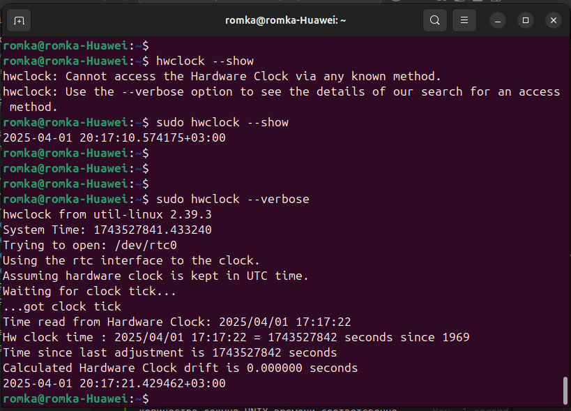

= История №2: Компьютерное время
Выполнил работу: Касимов Роман Эльмирович, ст. гр. Б22-515

== Описание лабораторного стенда

=== Описание используемой рабочей среды
* Процессор: Intel(R) Core(TM) i3-10110U CPU, 2.10GHz, 2 ядра, 4 логических процессора
* Установленная оперативная память (RAM): 8Gi.
* Тип памяти: DRAM 
* Операционная система: Ubuntu 24.04 LTS
* Компилятор: g++(gcc) 13.3.0
* Язык программирования: c

== Теоретические вопросы
=== Структуры данных для хранения меток времени
* Язык C:
.. struct timespec (наносекундная точность)
.. struct timeval (микросекундная точность)
.. struct __timespec64 (аналог timespec с поддержкой времени после 2038 года)
.. time_t
.. tm (в основном для календарных операций)
* Язык C++
.. std::chrono 
. Часы реального времени в Linux
В файловой системе ОС linux часы реального времени представленны симлинком _/dev/rtc_ на _rtc0_

Для работы с часами можно использовать файлы _date_, _time_, _since_epoch_, позволяющие узнать текущие дату, время и количество секунд UNIX времени соответсвенно
Также доступна утилита командной строки _hwclock_

=== Типы часов, предоставляемых операционной системой
* С
.. CLOCK_REALTIME
.. CLOCK_MONOTIC
.. CLOCK_BOOTTIME
.. CLOCK_PROCESS_CPUTIME
* С++ (std::chrono)
.. system_clock
.. steady_clock
.. high_resolution_clock

=== Отличия типов часов
* CLOCK_REALTIME (C) -- системное время
* CLOCK_MONOTIC (C) -- монотонные часы, не зависящие от загрузки системы
* CLOCK_BOOTTIME (C) -- системное время, включает время работы системы + время в спящем режиме
* CLOCK_PROCESS_CPUTIME (C) -- тики, затраченные на процесс
* system_clock (C++) - аналог CLOCK_REALTIME
* steady_clock (C++) - аналог CLOCK_MONOTIC
* high_resolution_clock (C++) - максимально точные часы

=== Високосная секунда
Високосная секунда - секунда, ионгда добавляемая в шкалу всемирного координированного времени (UTC) для согласования его со средним солнечным временем
Согласно бюллетеню С №67 Международной службы вращения Земли и опорных систем, от високосных секунд планируется отказаться
Однако можно предположить, что следующая високосная секунда могла бы быть добавлена (или убавлена) тогда, когда время UTC отставало бы на солнечное время примерно на одну секунду

=== RDTSC в код на C ([cpu] intrinsics)
Использовать инструкции RDTSC в C можно с помощью интринсики компилятора (в нашем случае gcc):
[source,c]
----
#include <x86intrin.h>

uint64_t rdtsc() {
    return __rtdsc();
}
----

=== Пересчёт тактов
Чтобы преобразовать такты (TSC) в секунды, определим частоту TSC
Посмотрим, взведён ли флаг constant_tsc в файле /proc/cpuinfo. Если флаг взведён, то cpu поддерживает инвариантный tsc, соответсвенно его частота равна номинальной частоте процессора

image::../images/tsc.png[tsc]

Посмотрим, чему равна номинальная частота процессора

image::../images/model.png[proc]

Тогда: один такт == 1 / 2.1e9, что примерно равно 0.476 нс