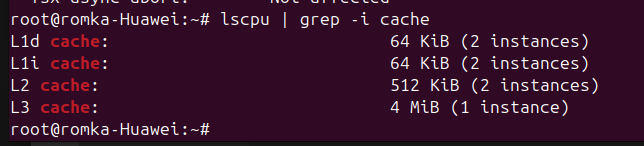
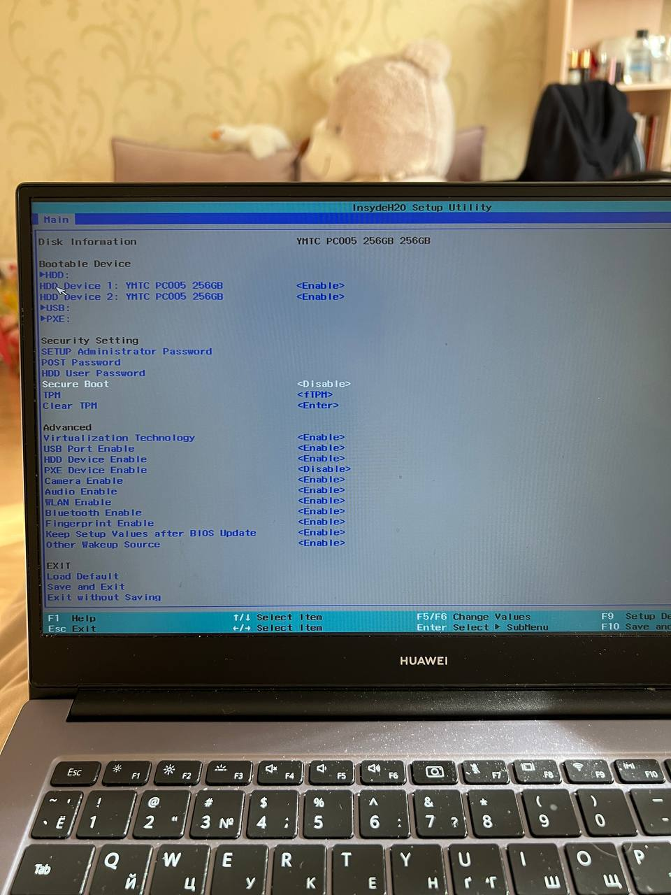
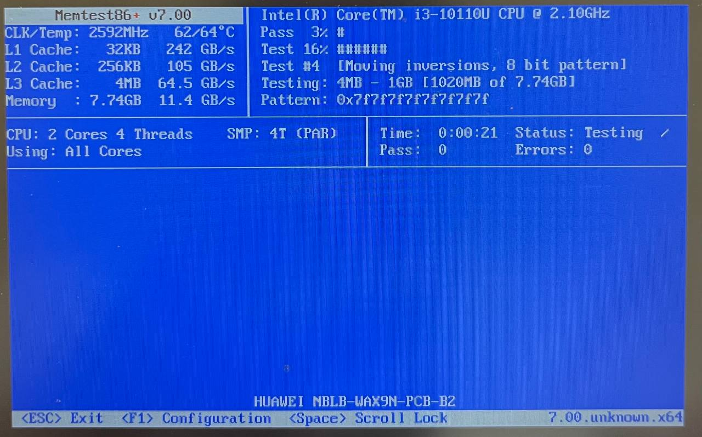
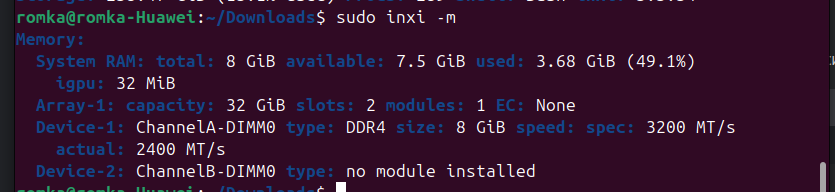
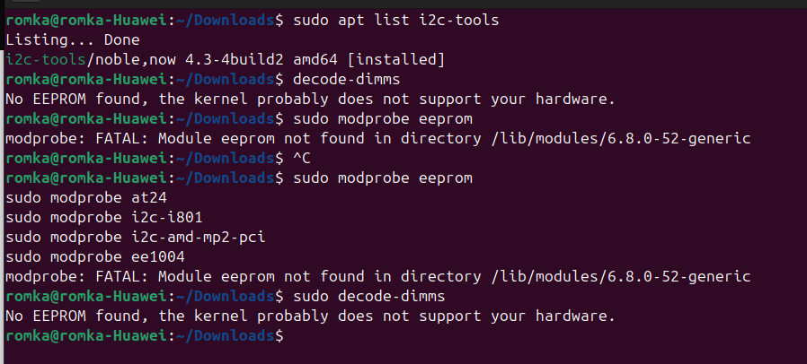

= История №3: Память и кэш
Выполнил работу: Касимов Роман Эльмирович, ст. гр. Б22-515

== Описание лабораторного стенда

=== Описание используемой рабочей среды
* Процессор: Intel(R) Core(TM) i3-10110U CPU, 2.10GHz, 2 ядра, 4 логических процессора
* Установленная оперативная память (RAM): 8Gi.
* Тип памяти: DRAM 
* Операционная система: Ubuntu 24.04 LTS
* Компилятор: g++(gcc) 13.3.0
* Язык программирования: c

== Теоретическая часть работы
=== Размеры кэшей
Проверим пользователем _root_ вывод команды lscpu

В выводе команды можно заметить, что L1 и L2 кэш являются отдельными для каждого ядра (об этом нам говорит несколько инстансов этих кэшей)
При этом _L1d_ и _L1i_ показывает нам, что кэш L1 делится на кэш, хранимый инструкции (i) и данные (d)

==== Размер кэшей же таков:
* l1: 128 Кб
* l2: 512 Кб
* l3: 4 Мб

=== Тайминги оперативной памяти
В самой популярной интернет-энциклопедии https://ru.wikipedia.org/wiki/%D0%A2%D0%B0%D0%B9%D0%BC%D0%B8%D0%BD%D0%B3%D0%B8_[Википедия] можно найти следующую информацию:

> Переменные задержки также называют таймингами и для краткости записывают в виде трёх чисел, по порядку: латентность строба адреса столбца — Column Address Strobe (CAS) latency (CL), задержка активации строки — Row Address to Column Address Delay (TRCD) и время обновления (предзаряда) строки — Row Precharge Time (TRP). 

Существует и возможный _четвёртый_ параметр:

> Иногда формула латентности памяти может состоять из четырёх цифр. Последний параметр называется временем рабочего цикла DRAM — DRAM Cycle Time (TRAS/TRC) и характеризует быстродействие всей микросхемы памяти. Он определяет отношение интервала времени активности строки — Row Active Time, так же называемого латентностью строба адреса строки — Row Address Strobe (TRAS), к периоду, в течение которого завершается полный цикл открытия и обновления (предзаряда) строки — Row Cycle Time (TRC), также называемого циклом банка (Bank Cycle Time).

А записываются тайминги, например, так:

*CL16-18-18-36*

=== DDR
_DDR (Double Data Rate)_ - синхронная динамическая (оперативная) память с произвольным доступом и удвоенной скоростью передачи данных, т.е при её работе эффективная частота равна удвоенной реальной частоте, на которой работают микросхемы памяти

=== DIMM
_DIMM (Dual Inline Memory Module)_ - модуль памяти, используемый в персональных компьютерах для увеличения оперативной памяти. Представляет собой небольшую печатную плату с установленными на ней микросхемами памяти. Упаковывают DDR, DDR2, DDR3 и т.д

=== Пропускная способность
С помощью всё той же утилиты _lscpu_ можем узнать тактовую частоту и размеры регистров

Тактовая частота:

Размеры регистров:

==== Таким обращом, пропускная способность для загрузки:
* Одного ядра: 64 * 900 * 10^6 = *57,6ГБ/c*
* Всех ядер: *230,4ГБ/c* (всего 4 ядра)

== Практическая часть работы
=== memtest86+
На моём ноутбуке Ubuntu установлена на диске D, а memtest86 установлена по умолчанию.
Однако при запуске из меню загрузчика возникала проблема *некорректная подпись shim*

Проблему получилось решить выключением опции *Secure Boot* в настройках

В итоге, в меню программе memtest86 можно было увидеть следующие значения:

==== Пропускная способность:
* l1: 242 Гб/с
* l2: 105 Гб/с
* l3: 64.5 Гб/с
* оперативная память: 11.4 Гб/с

=== Сравнение теоретических значений с практическими
В рамках теоретической работы было получено, что пропускная способность одного ядра: *57,6 Гб/с*, что на 10% процентов меньше, чем пропускная способность кэша l3 и в 4 раза больше, чем пропускная способность оперативной памяти

=== Определение таймингов и тактовой частоты
С помощью утилиты inxi (и ещё множества утилит) можно было определить, что эффективная частота равна 3200 мегатранзакций в секунду, а действительная равна 2400

При определении таймингов возникли проблемы. В процессе ресёрча на просторах интернета было найдено множество тредов с проблемами определения таймингов на дистрибутивах Linux.

==== Прилагаю ссылки на самые популярные:
* https://superuser.com/questions/519822/how-to-check-ram-timings-in-linux/1689844#1689844[check Ram timings]
* https://www.linux.org.ru/forum/general/16896186[тайминги DDR]
* https://forum.ubuntu.ru/index.php?topic=299347.0[характеристики памяти]
* https://tavportal.ru/blog/linux/176-kak-uznat-tip-operativnoj-pamyati,-kolichestvo-planok-i-chastotu-v-linux[тип оперативной памяти]

Почти в каждом треде (закрытом не позже 2014 года xD) "экспертами" было предложена следующая последовательность действий:

> sudo aptitude install i2c-tools
sudo modprobe eeprom
sudo modprobe at24
sudo modprobe i2c-i801
sudo modprobe i2c-amd-mp2-pci
sudo modprobe ee1004
decode-dimms

Либо же, использование одной из следующих утилит:

> dmidecode
lshw
inxi

Однако ни одна из представленных утилит не позволила мне узнать тайминги системы, а список команд, представоенных выше, выводит:

