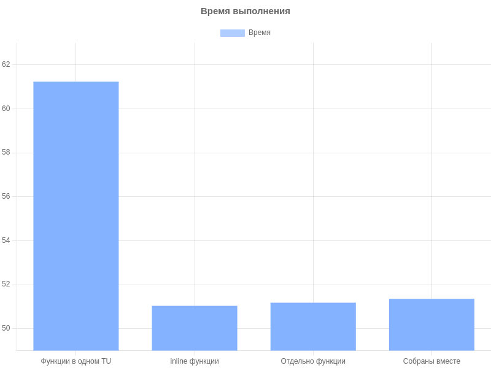

= История №1: Цена вызова
Выполнил работу: Касимов Роман Эльмирович, ст. гр. Б22-515

== Описание лабораторного стенда

=== Описание используемой рабочей среды
* Процессор: Intel(R) Core(TM) i3-10110U CPU, 2.10GHz, 2 ядра, 4 логических процессора
* Установленная оперативная память (RAM): 8Gi.
* Тип памяти: DRAM 
* Операционная система: Ubuntu 24.04 LTS
* Компилятор: g++ 13.3.0
* Язык программирования: c++

== Описание проделанной работы
=== В процессе выполнения задания были разработанны следующие _процедуры_:
* Процедура вычисления дискриминанта по коэффициентам квадратного уравнения
* Процедура вычисления первого корня квадратного уравнения
* Процедура вычисления второго корня квадратного уравнения

=== Также было сформировано 4 _исполняемых файла_ для вычисления времени работы программы по нахождению корней 10000000 квадратных уравнений:
* Со всеми ф-циями в одном TU
* Со всеми _inline_ функциями в одном TU
* С функциями в отдельном TU, скомпилированном отдельно
* С функциями в отдельном TU, скомпилированном вместе с управляющей программой

=== В резузльтате измерения времени работы были получены следующие результаты:
[cols=2]
|====
|*Способ сборки исполняемого файла*
|*Время _сек_*

|Первый вариант
|61.2382 

|Второй вариант
|51.0366

|Третий вариант
|51.1788

|Четвертый вариант
|51.3553
|====

=== Гистограмма времени выполнения программы

== Вывод
В результате выполнения задания было собрано несколько исполняемых файлов, позволяющих измерить время работы программы по нахождению корней 10000000 квадратных уравнений разными способами.

Экспериментально было выявлено, что время работы программы при расположении всех функций в одном TU превосходит время выполнения других вариаций примерно на 19 процентов

Время работы при всех остальных вариатах сборки равно между собой в пределах одной секунды. Самым быстрым показал себя вариант с inline функциями в одном TU.

Таким образом, можно сделать вывод, что время выполнения программы не зависит от способа сборки исполняемого файла. В остальных же случаях, подстановка тела функции в код программы показывает себя быстрее всего