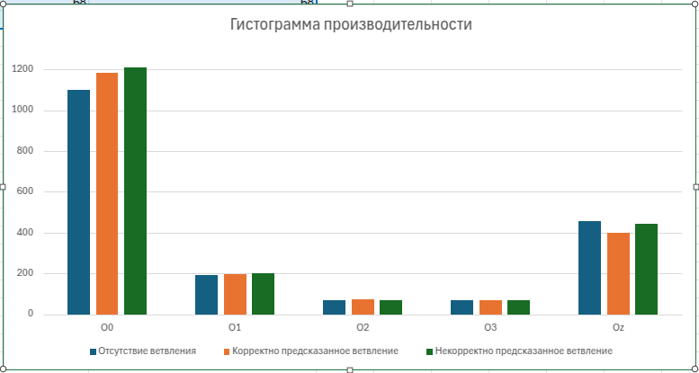

= История №10: Ручное управление оптимизацией ветвлений
Выполнил работу: Касимов Роман Эльмирович, ст. гр. Б22-515

== Описание и коы тестововых алгоритмов

=== Описание
Для эксперимента был написан код, который генерирует массив на 100 миллионов эл-тов, после чего считает сумму каждого тысячного и остальных.

Для ветвления хода программы используются директивы LIKELY и UNLIKELY

=== Коды алгоритмов
Код алгоритма с правильным предказанием ветвления
[source, c++]
----
#include <iostream>
#include <vector>
#include <chrono>
#include <random>

#ifndef LIKELY
#define LIKELY(x)   __builtin_expect(!!(x), 1)
#endif

#ifndef UNLIKELY
#define UNLIKELY(x) __builtin_expect(!!(x), 0)
#endif

int main() {
    const size_t N = 100'000'000;
    std::vector<int> data(N);
    
    std::random_device rd;
    std::mt19937 gen(rd());
    std::uniform_int_distribution<int> dist(1, 100);
    for (auto& x : data) x = dist(gen);

    int common_sum = 0;
    int rare_sum = 0;

    auto start = std::chrono::high_resolution_clock::now();
    for (size_t i = 0; i < N; ++i) {
        if (UNLIKELY(i % 1000 == 0)) { 
            int tmp = data[i] * 2;
            rare_sum += tmp;
        } else {
            int tmp = data[i] * 2;
            common_sum += tmp;
        }
    }
    auto duration = std::chrono::duration_cast<std::chrono::milliseconds>(
        std::chrono::high_resolution_clock::now() - start
    ).count();

    std::cout << "Common sum: " << common_sum << "\n";
    std::cout << "Rare sum: " << rare_sum << "\n";
    std::cout << "Time: " << duration << " ms\n";
    return 0;
}
----

=== Таблицы рузльтатов эксперимента
Таблица сравнения производительности
[cols = 6]
|====
|Способ
|O0
|O1
|O2
|O3
|Oz

|Отсутствие ветвления
|1099
|193
|69
|69
|458

|Корректно предсказанное ветвление
|1183
|197
|75
|68
|401

|Некорректно предсказанное ветвление
|1209
|199
|69
|68
|442
|====

==== Гистограмма производительности работы алгоритма нахождения решения квадратного уравнения с различными флагами оптимизации:

== Выводы
В результате выполнения лабораторной работы были изучены и применены на практике возможности ветвления программы

Была написанна программа, которая считает сумму каждого тысячного элемента и остальных элементов массива на 100 миллионов элементов

В результате эксперимента была построена гистограмма производительности работы. Можно сделать вывод, что корректное ветвление дало наибольший прирост производительности при оптимизации кода по размеру, а некорректно спрогнозированное ветвление приводит к наибольшему приросту времени при флаге O0.