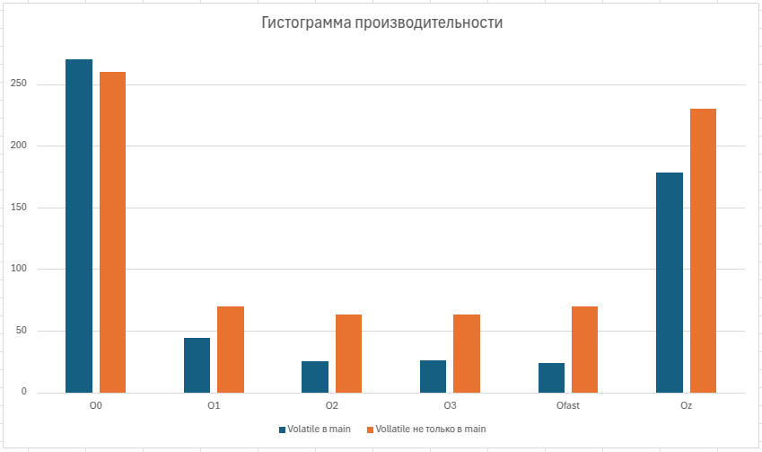

= История №9: Контракты с компилятором
Выполнил работу: Касимов Роман Эльмирович, ст. гр. Б22-515

== Описание и коы тестововых алгоритмов

=== Описание
Для первого задания будем использовать алгоритм решения 10 миллионов квадратных уравнений, однако коэффициенты будем не генерировать, а просто задавать им значение в коде. Далее будем всем переменным устанавливать const и volatile.

Для второго задания будем считать сумму массива из 10 миллионов единиц. 

=== Коды алгоритмов
Код алгоритма решения квадратных уравнений
[source, c++]
----
#include <iostream>
#include <chrono>
#include <cmath>

void solve_quadratic(double a, double b, double c, double& x1, double& x2, int& roots) {
    double discriminant = b * b - 4 * a * c;
    if (discriminant > 0) {
        roots = 2;
        x1 = (-b + sqrt(discriminant)) / (2 * a);
        x2 = (-b - sqrt(discriminant)) / (2 * a);
    } else if (discriminant == 0) {
        roots = 1;
        x1 = -b / (2 * a);
    } else {
        roots = 0;
    }
}

int main() {
    const size_t N = 10'000'000; 
    double a = 1.0, b = 2.0, c = 1.0;
    double x1, x2;
    int roots;

    auto start = std::chrono::high_resolution_clock::now();
    for (size_t i = 0; i < N; ++i) {
        solve_quadratic(a, b, c, x1, x2, roots);
    }
    auto end = std::chrono::high_resolution_clock::now();
    auto duration = std::chrono::duration_cast<std::chrono::milliseconds>(end - start).count();

    std::cout << "Time: " << duration << " ms\n";
    return 0;
}
----

Код вычисления суммы массива
[source, c++]
----
#include <vector>
#include <numeric>
#include <chrono>
#include <iostream>

int main() {
    const size_t N = 10'000'000;
    std::vector<int> data(N, 1);

    auto start = std::chrono::high_resolution_clock::now();
    volatile int sum = std::accumulate(data.begin(), data.end(), 0);
    auto end = std::chrono::high_resolution_clock::now();
    auto duration = std::chrono::duration_cast<std::chrono::nanoseconds>(end - start).count();

    std::cout << "Time: " << duration << " ns\n";

    return 0;
}
----

=== Таблицы рузльтатов эксперимента
Таблица сравнения производительности при применении const
[cols = 4]
|====
|Метод
|Время выполнения, мс

|Без const
|266

|С конст у верхней границы итерирования
|272

|С конст везде, где можно
|271
|====

Таблица сравнения производиельности с volatile и разными флагами оптимизации
[cols = 4]
|====
|Флаг оптимизации
|Время выполнения c volatile переменными внутри main, мс
|Время выполнения с volatile и внутри ф-ции, мс

|O0
|270
|260

|O1
|44
|70

|O2
|25
|63

|O3
|26
|63

|Ofast
|24
|70

|Oz
|178
|230
|====

Таблица производительности получения суммы масива из 10 миллионов эл-тов
[cols = 4]
|====
|Тип
|Время выполнения, мкс

|Без volatile
|0.143

|С volatile
|8142.1
|====

==== Гистограмма производительности работы алгоритма нахождения решения квадратного уравнения с различными флагами оптимизации:

== Выводы
В результате выполнения лабораторной работы были изучены и применены на практике такие способы "общения" с компилятором, как ключевые слова "const" и "volatile"

Была протестирована производительность алгоритма с переменными без const, с const верхней границей итерирования и со всеми возможными const переменными. Данные манипуляции не повлияли на производительность алгоритма, при этом время работы программы с const даже незначительно увеличился.

При установке ключевого слова volatile и смене флагов оптимизации было установлено, что скорость выполнения (ожидаемо) растет при увеличении агрессивности оптимизации. Однако при добавлении объявления volatile перемненной внутрь функции, производительность программы заметно уменьшилась. Так, время работы программы с флагом Ofats увеличилсось примерно в 3 раза. Была построена гистограмма времени работы программы с различными флагами.

Также на примере программы, заполняющей неисподбзуемую переменную суммой массива, было установлено, что при время выполнения без volatile и с ним отличаются примерно в 10 тысяч раз, что ожидаемо и можно объяснить отсутствием оптимизации компилятора к использованию volatile.