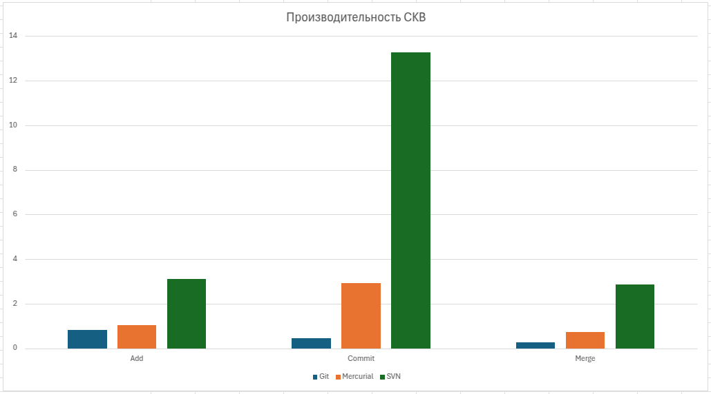

= История №11: Системы контроля версий моложе в(н)ас
Выполнил работу: Касимов Роман Эльмирович, ст. гр. Б22-515

== Результаты вычислительных экспериментов

=== Описание
Для эксперимента был написан код на языке Python, который создает (изменяет) нужное количество файлов, добавляя в него рандомные строки длиной в 10 символов
[source, python]
----
import sys
import string

from random import choice

def generate_rnd_str(num):
    return ''.join([choice(string.ascii_letters) for _ in range(num)] + ['\n'])

for i in range(int(sys.argv[1]), int(sys.argv[2])):
    with open(str(i) + 'file.txt', 'a', encoding='utf-8') as file:
        file.write(generate_rnd_str(10))
----

В эксперименте были сначала созданы 10000 файлов, после чего проекты были инициализированы разными системами контроля версий. Далее создавались несколько веток (ревизий), после чего выполнялся merge

=== Таблицы рузльтатов эксперимента
Таблица сравнения производительности
[cols = 4]
|====
|Действие
|Git
|Mercurial
|SVN

|Добавление в индекс, с
|0,827
|1,055
|3,095

|Коммит, с
|0,464
|2,921
|13,282

|Мёрдж, с
|0,276
|0,730
|2,871
|====

==== Гистограмма производительности работы систем контроля версий:

== Сравнение
* Git
.. Предоставляет такие "мощные" инструменты, как rebase, stash и submodules
.. Существет широкая экосистема в лице GitHub, GitLab и BitBucket
.. Изначально был разработан для ядра Linux
* Mercurial
.. Хорошо для хранения бинарных файлов
.. Схожие с git команды, однако init сразу создает директорию, а не инициализирует существующую
* SVN
.. Почти нельзя для красоты сломать историю репозитория
.. Всегда нужен сервер

== Выводы
Таким образом, в данной лабораторной работе сравнивались такие системы контроля версий, как git, mercurial и svn.

Результаты сравнения производительности показали, что git выполняет любую операцию (add, commit, merge) быстрее, чем остальные. При этом svn почти в 20 раз больше времени требуется на коммит. Также были приведены некоторые особенности рассматриваемых систем.