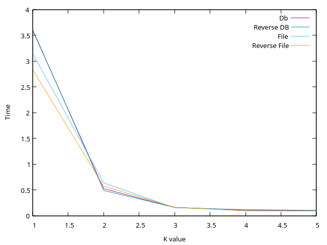

= История №3: SQLite3
Выполнил работу: Касимов Роман Эльмирович, ст. гр. Б22-515

== Описание лабораторного стенда

=== Описание используемой рабочей среды
* Процессор: Intel(R) Core(TM) i3-10110U CPU, 2.10GHz, 2 ядра, 4 логических процессора
* Установленная оперативная память (RAM): 8Gi.
* Тип памяти: DRAM 
* Операционная система: Ubuntu 24.04 LTS
* Компилятор: g++(gcc) 13.3.0
* Язык программирования: c++

=== Информация о выбранных параметрах
В лабораторной работе были выбраны значения k, равные десяти в степени от одного до пяти включительно

Объем данных - _90МБ_

== Диаграммы сравнения производительности
В первую очередь, рассмотрим производительность программ для записи данных в файл или базу данных

=== Полученные результаты записи данных:
[cols = 5]
|====
|Значение k
|Время записи в файл, с
|Время записи в файл при обратном порядке, с
|Время записи в бд, с
|Время записи в бд при обратном порядке, с 

|10
|202.189
|165.075
|167.158
|149.628

|100
|28.018
|27.941
|22.817
|17.916

|1000
|6.044
|5.75
|5.89
|5.09

|10000
|4.717
|4.043
|4.701
|3.717

|100000
|4.122
|3.46
|3.781
|3.295
|====

=== График зависимости времени выполнения от степени k

Рассмотрим результаты чтения всех данных из файла и базы данных:

=== Полученные результаты чтения данных:
[cols = 5]
|====
|Значение k
|Время чтения из файла, с
|Время чтения из файла при обратном порядке, с
|Время чтения из бд, с
|Время чтения из бд при обратном порядке, с 

|10
|3.148
|2.83
|3.593
|3.61

|100
|0.638
|0.574
|0.525
|0.491

|1000
|0.156
|0.165
|0.162
|0.162

|10000
|0.122
|0.096
|0.106
|0.116

|100000
|0.108
|0.093
|0.1
|0.105
|====

=== График зависимости времени выполнения от степени k

Рассмотрим результат чтения данных из файла и бд при выборке только тех записей, которые содержат подстроку "ab"

=== Полученные рузльтаты чтения данных с фильтром:
[cols = 5]
|====
|Значение k
|Время чтения из файла, с
|Время чтения из файла при обратном порядке, с
|Время чтения из бд, с
|Время чтения из бд при обратном порядке, с 

|10
|1.616
|1.593
|0.964
|1.069

|100
|0.356
|0.364
|0.33
|0.321

|1000
|0.134
|0.12
|0.204
|0.224

|10000
|0.161
|0.186
|0.112
|0.151

|100000
|0.096
|0.103
|0.101
|0.138
|====

=== График зависимости времени выполнения от степени k

== Выводы
В рамках лабораторной работы были исследованы скорость чтения и записи данных в файл, а также в базу данных SQLite3.
Были построены графики сравнительного анализа времени выполнения операций чтения, записи и чтения с фильтрацией.

Из полученных результатов можно сделать вывод, что запись в базу данных происходит быстрее, чем в обычный файл. Это может быть связано с использованием транзакций, в отсутвие которых операция записи в базу данных была бы дольше, чем запись в файл вследствие накладных расходов на работу с БД.

Операция чтения из файла при большом количестве записей оказалась быстрее, чем чтения из базы данных

При исследовании чтения с фильтром можно заметить, что чтение из файла резко ускоряется при k=1000 и является заметно быстрее, чем чтении из базы. Это может быть связано с проверкой наличия подстроки в данных. При малом количестве объемных данных поиск осуществялется дольше, чем при большом колиечстве малых.